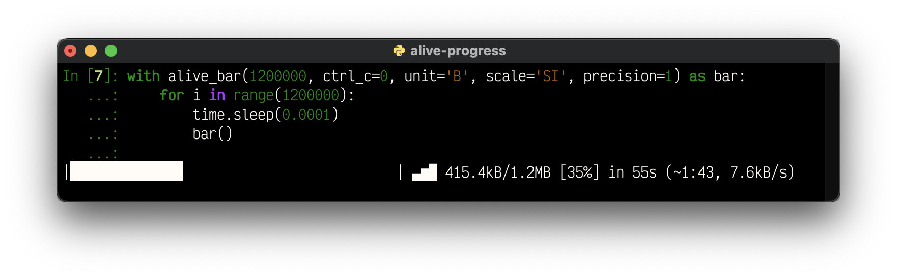
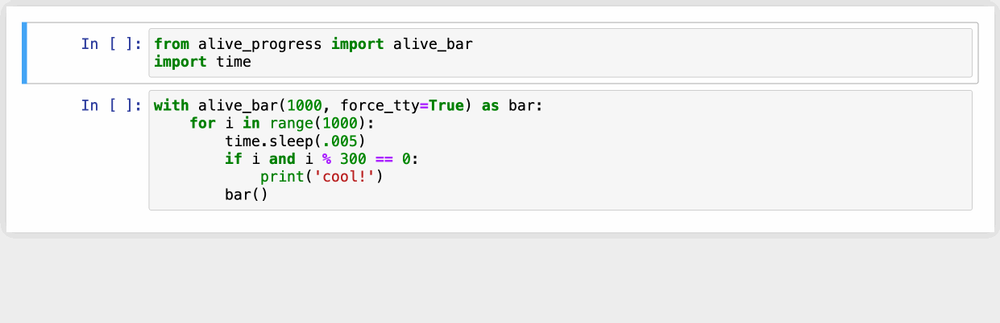
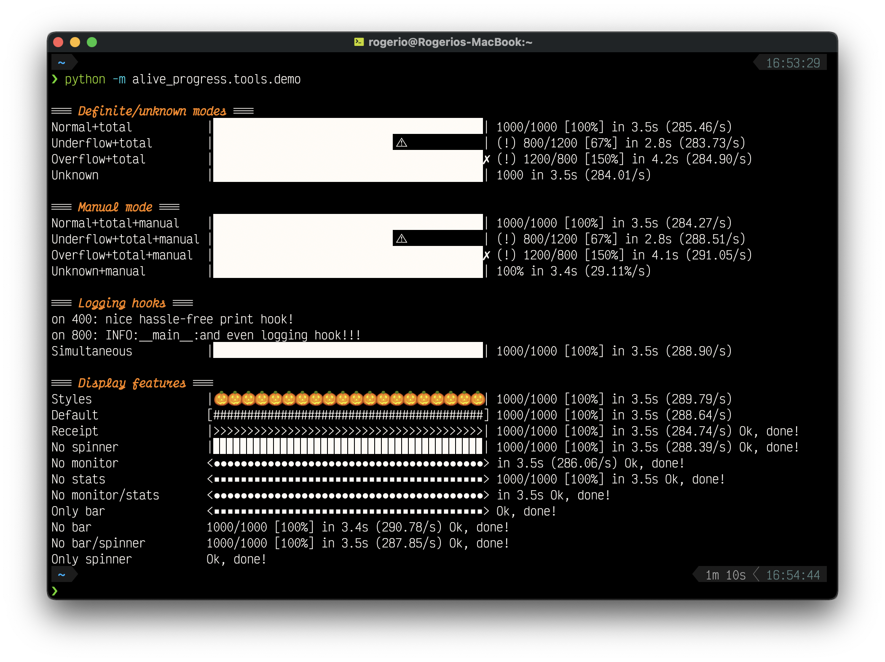
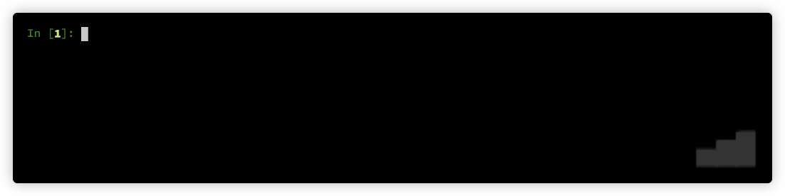
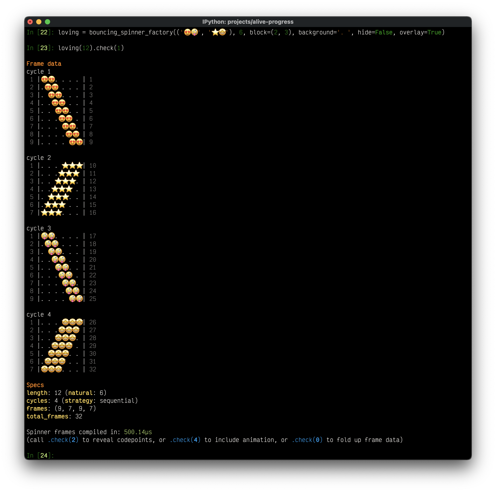
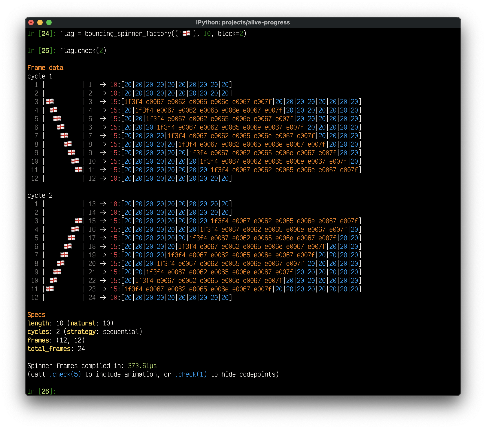
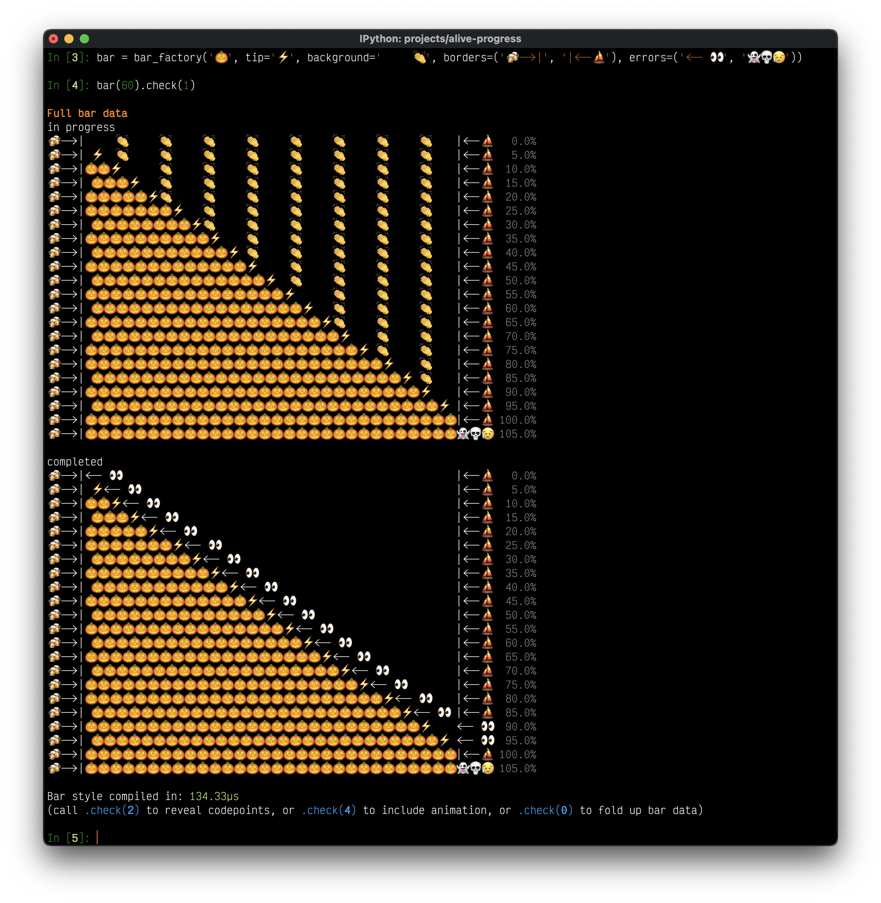
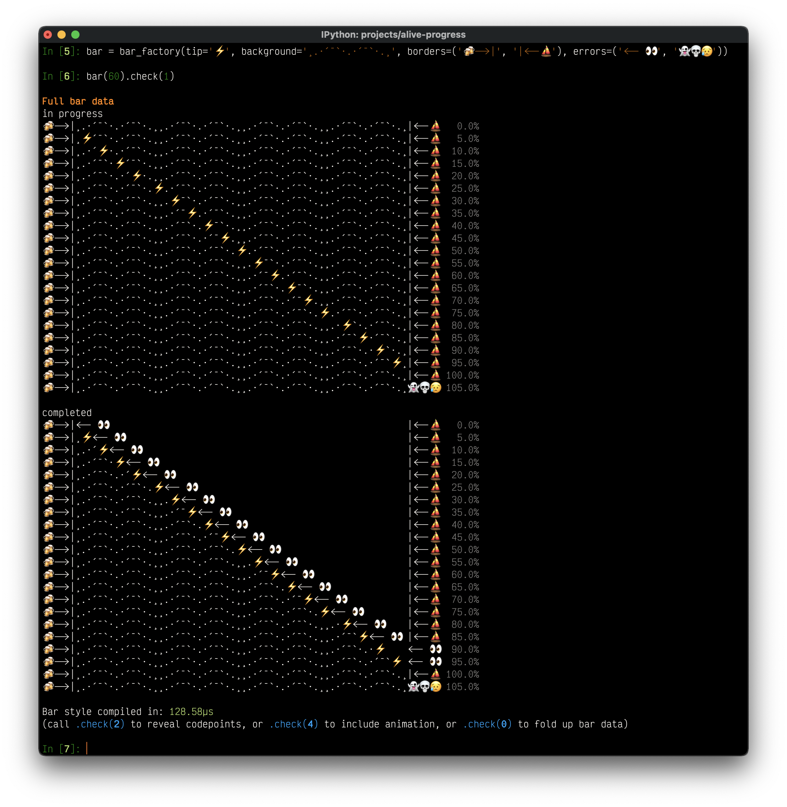
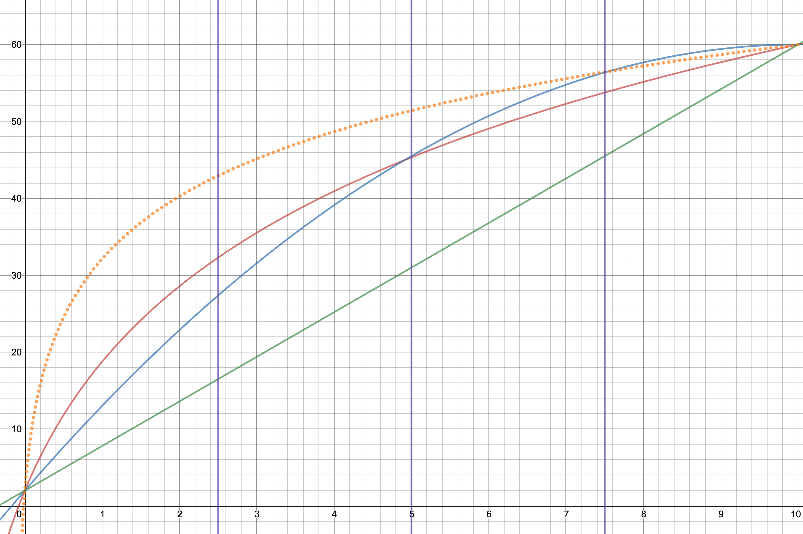
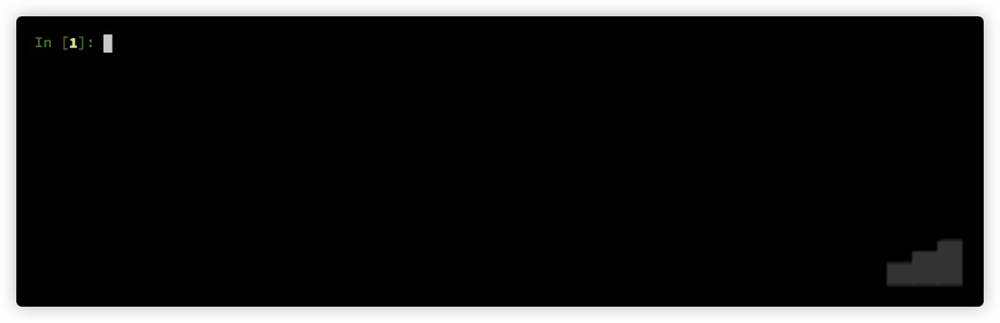

[](https://www.buymeacoffee.com/rsalmei)
[](https://www.paypal.com/donate?business=6SWSHEB5ZNS5N&no_recurring=0&item_name=I%27m+the+author+of+alive-progress%2C+clearly+and+about-time.+Thank+you+for+appreciating+my+work%21&currency_code=USD)


# alive-progress :)
### A new kind of Progress Bar, with real-time throughput, ETA, and very cool animations!

[](https://gitHub.com/rsalmei/alive-progress/graphs/commit-activity)
[](https://pypi.python.org/pypi/alive-progress/)
[](https://pypi.python.org/pypi/alive-progress/)
[](https://pypi.python.org/pypi/alive-progress/)
[](https://pepy.tech/project/alive-progress)

Have you ever wondered where your lengthy processing was, and when it would finish? Ever found yourself hitting [RETURN] now and then to ensure it didn't hang, or if, in a remote SSH session, the connection was still working? Ever needed to *pause* some processing for a while, return to the Python prompt for a manual inspection or fixing an item, and then *resume* the process seamlessly? I did...

I've started this cool progress bar thinking about all that, the **alive-progress**! 😃


I like to think of it as a new kind of progress bar for Python since it has, among other things:

- a **live spinner** that is incredibly cool and clearly shows your lengthy process did not hang, or your ssh connection did not drop;
- a **visual feedback** which reacts to your processing, as the live spinner will go faster or slower with it;
- an **efficient** multi-threaded bar, which updates itself at a fraction of the actual processing speed (1,000,000 iterations per second equates to roughly 60 updates per second) to keep **CPU usage low** and avoid terminal spamming (you can also calibrate this to your liking);
- nice monitoring of both _position and throughput_ of your processing;
- an **ETA** (expected time of arrival) with an intelligent _exponential smoothing algorithm_, that shows the time to completion;
- automatic **print** and **logging** hooks, which allow print statements and logging messages to work _effortlessly_, right amid an animated bar, and even enriching them with the current bar position when they occur;
- a **nice receipt** is printed when your processing finishes, including the last bar rendition, the elapsed time, and the observed throughput;
- it detects **under and overflows**, enabling you to track hits, misses, or any desired count, not necessarily the actual iterations;
- it automatically detects if there's an **allocated tty**, and if there isn't (like in a shell pipeline), only the final receipt is printed (so you can safely include it in any code, and rest assured your log file won't get thousands of progress lines);
- you can **pause** it! I think that's an unprecedented feature for progress bars ANYWHERE — in Python or any other language — no one has ever done it! It's incredible to be able to get back to the Python prompt during any running process! Then you can manually adjust an item or prepare something and get back into that running process as if it had never stopped!! All `alive_bar` widgets are kept as they were, and the elapsed time nicely ignores the paused time!;
- it is **customizable**, with a growing smorgasbord of bar and spinner styles, as well as several factories to quickly generate yours! Now (📌 new in 2.0), we even have super powerful and cool `.check()` tools in both bars and spinners to help you design your animations! You can see all the frames and cycles exploded on screen, with several verbosity levels, even including an **alive** rendition! 😜


## 📌 NEW in 3.0 series!

Yep, I could finally get this version out! These are the new goodies:

- Units support! You can now label the data you're processing, like `B`, `bytes`, or even `°C`!
- Automatic scaling! With support for SI (base 1000), IEC (base 1024), and even an alternate SI with base 1024, you'll be well served!
- Configurable precision! When your numbers are scaled, you get to choose how many decimals they display!
- Automatic stats scaling for slow throughputs! If your processing takes minutes or more, now you'll see rates per minute, per hour, and even per day! (It works within the auto-scaling system!)
- Support for using `sys.stderr` and other files instead of `sys.stdout`!
- Smoothed out the rate estimation with the same Exponential Smoothing Algorithm that powers the ETA, so the bar returns a more realistic ETA!
- Query the currently running widgets' data, like the monitor, rate, and ETA!
- New help system on configuration errors, which explains why a value was not accepted, and what were the expected ones!

#### Highly anticipated fixes

- Support for reusing logging handlers! No more `TypeError: unhashable type: 'types.SimpleNamespace'`.
- Support for logging when using `RotatingFileHandler`s! Yep, seek support is here.
- Fix unknown mode always ending with a warning (!)

And last but not least, a more polished layout for you to enjoy your progress!



## 📌 NEW in 2.4 series!

Now, `alive_bar` supports *Dual Line* text mode!

If you ever wanted to include longer situational messages within the bar, you probably felt squeezed into one line. You had to shrink the beautifully animated bar or, even worse, remove widgets (!) to be able to see what you needed...
<br>Not anymore!! You can now make the bar *Dual Line*, and put text below it!

Yes, there's a message below the whole bar, and any other print/logging messages scroll above it!

```python
letters = [chr(ord('A') + x) for x in range(26)]
with alive_bar(26, dual_line=True, title='Alphabet') as bar:
    for c in letters:
        bar.text = f'-> Teaching the letter: {c}, please wait...'
        if c in 'HKWZ':
            print(f'fail "{c}", retry later')
        time.sleep(0.3)
        bar()

on 7: fail "H", retry later
on 10: fail "K", retry later
Alphabet |███████████████████████████▊            | ▃▅▇ 18/26 [69%] in 6s (3.2/s, eta: 3s)
-> Teaching the letter: S, please wait...
```

There's also a new `finalize` function parameter in `alive_it` which enables you to set the title and/or text of the final receipt, and improved logging support which detects customized loggers.


## 📌 NEW in 2.3 series!

This is all about customization; the core widgets can now be changed:
- send a string to the `monitor`, `elapsed`, and `stats` widgets to make them look anyway you want!

> It's incredible that these strings support all Python format features, so you can e.g., `{percent:.1%}` 😉.

They can be further customized when on the **final receipt**!
- new `monitor_end`, `elapsed_end`, and `stats_end`, with dynamic formats inherited from the standard ones!

> If you've hidden some widgets before, just so they wouldn't appear on the receipt, now you can see them in all their running glory, and hide just the receipt ones! Or the other way around 😜

Another addition, now `alive-progress` beautifully renders its cool final receipt whenever it is stopped, even if you CTRL+C it prematurely! I don't know why I haven't thought about that before...
```python
Download |██████████████████⚠︎                     | (!) 45/100 [45%] in 4.8s (9.43/s)
```

And finally, you can choose to disable CTRL+C at all! The default is the safer `ctrl_c=True`, which does make CTRL-C work as usual.
<br>Disable it `ctrl_c=False`, to make your interactive `alive_bar` much smoother to use (there are no stack traces if you stop it), and/or if it is at the top-level of your program!

> Beware: If it is e.g. inside a for-loop, it will just continue to the next iteration, which may or may not be what you want...
```python
for i in range(10):
    with alive_bar(100, ctrl_c=False, title=f'Download {i}') as bar:
        for i in range(100):
            time.sleep(0.02)
            bar()

Download 0 |████████▊⚠︎                              | (!) 22/100 [22%] in 0.6s (36.40/s)
Download 1 |████████████████▊⚠︎                      | (!) 42/100 [42%] in 1.0s (41.43/s)
Download 2 |██████▍⚠︎                                | (!) 16/100 [16%] in 0.4s (39.29/s)
Download 3 |█████▋⚠︎                                 | (!) 14/100 [14%] in 0.4s (33.68/s)
Download 4 |█████████████▎⚠︎                         | (!) 33/100 [33%] in 0.8s (39.48/s)
Download 5 |███████▎⚠︎                               | (!) 18/100 [18%] in 0.5s (37.69/s)
Download 6 |█████▎⚠︎                                 | (!) 13/100 [13%] in 0.3s (37.28/s)
Download 7 |████████████⚠︎                           | (!) 30/100 [30%] in 0.8s (38.43/s)
Download 8 |██████⚠︎                                 | (!) 15/100 [15%] in 0.4s (36.26/s)
...
```


## 📌 NEW in 2.2 series!

Some major new features, often requested, have finally landed!
- bar title can be dynamically set, changed, or even removed after being displayed
- new custom fps system, which enables very slow refresh rates (to let it run on those k8s for long periods)
- the final receipt can be totally hidden (great for special effects, like using the cool spinners standalone)
- new support for `click.echo()` printing
- terminal columns detection is safer for exotic environments
- requires Python 3.7+


## 📌 NEW in the 2.1 series!

YES! Now `alive-progress` has support for Jupyter Notebooks and also includes a _Disabled_ state! Both were highly sought after, and have finally landed!
<br>And better, I've implemented an auto-detection mechanism for jupyter notebooks, so it just works, out of the box, without any changes in your code!!

See for yourself:



> It seems to work very well, but at this moment, it should be considered **experimental**.
> <br>There were instances in which some visual glitches have appeared, like two `alive_bar` refreshes being concatenated together instead of over one another... And it's something I think I can't possibly work around: it seems Jupyter sometimes refresh the canvas at odd times, which makes it lose some data. Please let me know on the issues if something funnier arises.


## 📌 NEW in 2.0 series!

This is a major breakthrough in `alive-progress`!
<br>I took 1 year developing it, and I'm very proud of what I've accomplished \o/

- now, there's complete support for Emojis 🤩 and exotic Unicode chars in general, which required MAJOR refactoring deep within the project, giving rise to what I called "**Cell Architecture**" => now, all internal components use and generate streams of cells instead of characters, and correctly interpret grapheme clusters — those so-called wide chars, which are encoded with a variable number of chars, but always take two cells on screen!! This has enabled us to render complex multi-chars symbols as if they were one, thus making them work on any spinners, bars, texts, borders and backgrounds, even when fractured!!! Pretty advanced stuff 🤓
- new super cool spinner compiler and runner, which generates complete animations ahead of time, and plays these ready-to-go animations seamlessly, with no overhead at all! 🚀
- the spinner compiler also includes advanced extra commands to generate and modify animations, like reshape, replace, transpose, or randomize the animation cycles!
- new powerful and polished `.check()` tools that compile and beautifully render all frames from all animation cycles of spinners and bars! they can even include complete frame data, internal codepoints, and even their animations! 👏
- bars engine revamp, with invisible fills, advanced support for multi-char tips (which gradually enter and leave the bar), borders, tips and errors of any length, and underflow errors that can leap into the border if they can't fit!
- spinners engine revamp, with standardized factory signatures, improved performance, new types, and new features: smoother bouncing spinners (with an additional frame at the edges), optimized scrolling of text messages (which go slower and pause for a moment at the edges), new alongside and sequential spinners, nicer effect in alongside spinners (which use weighted spreading over the available space), smoother animation in scrolling spinners (when the input is longer than the available space)
- new builtin spinners, bars, and themes, which make use of the new animation features
- new showtime that displays themes and is dynamic => it does not scroll the screen when it can't fit vertically or horizontally, and can even filter for patterns!
- improved support for logging into files, which gets enriched as the print hook is!
- several new configuration options for customizing appearance, including support for disabling any `alive-progress` widgets!
- includes a new iterator adapter, `alive_it`, that accepts an iterable and calls `bar()` for you!
- requires Python 3.6+ (and officially supports Python 3.9 and 3.10)

> Since this is a major version change, direct backward compatibility is not guaranteed. If something does not work at first, just check the new imports and functions' signatures, and you should be good to go. All previous features should still work here! 👍

This README was completely rewritten, so please take a comprehensive look to find great new details!!

---

## Get it

Just install with pip:

```sh
❯ pip install alive-progress
```


## Try it

If you're wondering what styles are builtin, it's `showtime`! ;)
```python
from alive_progress.styles import showtime

showtime()
```


I've made these styles just to try all the animation factories I've created, but I think some of them ended up very very cool! Use them at will, and mix them to your heart's content!


Do you want to see actual `alive-progress` bars gloriously running in your system before trying them yourself?

```sh
❯ python -m alive_progress.tools.demo
```



## Awake it

Cool huh?? Now enter an `ipython` REPL and try this:

```python
from alive_progress import alive_bar
import time

for x in 1000, 1500, 700, 0:
   with alive_bar(x) as bar:
       for i in range(1000):
           time.sleep(.005)
           bar()
```

You'll see something like this, with cool animations throughout the process 😜:
```
|████████████████████████████████████████| 1000/1000 [100%] in 5.8s (171.62/s)
|██████████████████████████▋⚠︎            | (!) 1000/1500 [67%] in 5.8s (172.62/s)
|████████████████████████████████████████✗︎ (!) 1000/700 [143%] in 5.8s (172.06/s)
|████████████████████████████████████████| 1000 in 5.8s (172.45/s)
```

Nice huh? Loved it? I knew you would, thank you 😊.

To actually use it, just wrap your normal loop in an `alive_bar` context manager like this:

```python
with alive_bar(total) as bar:  # declare your expected total
    for item in items:         # <<-- your original loop
        print(item)            # process each item
        bar()                  # call `bar()` at the end
```

And it's alive! 👏

So, in short: retrieve the items as always, enter the `alive_bar` context manager with the number of items, and then iterate/process those items, calling `bar()` at the end! It's that simple! :)


## Master it

- `items` can be any iterable, like for example, a queryset;
- the first argument of the `alive_bar` is the expected total, like `qs.count()` for querysets, `len(items)` for iterables with length, or even a static number;
- the call `bar()` is what makes the bar go forward — you usually call it in every iteration, just after finishing an item;
- if you call `bar()` too much (or too few at the end), the bar will graphically render that deviation from the expected `total`, making it very easy to notice overflows and underflows;
- to retrieve the current bar count or percentage, call `bar.current()`.

> You can get creative! Since the bar only goes forward when you call `bar()`, it is **independent of the loop**! So you can use it to monitor anything you want, like pending transactions, broken items, etc, or even call it more than once in the same iteration! So, in the end, you'll get to know how many of those "special" events there were, including their percentage relative to the total!


### Displaying messages

While inside an `alive_bar` context, you can effortlessly display messages tightly integrated with the current progress bar being displayed! It won't break in any way and will even enrich your message!
- the cool `bar.text('message')` and `bar.text = 'message'` set a situational message right within the bar, where you can display something about the current item or the phase the processing is in;
- the (📌 new) dynamic title, which can be set right at the start, but also be changed anytime with `bar.title('Title')` and `bar.title = 'Title'` — mix with `title_length` to keep the bar from changing its length;
- the usual Python `print()` statement, where `alive_bar` nicely cleans up the line, prints your message alongside the current bar position at the time, and continues the bar right below it;
- the standard Python `logging` framework, including file outputs, is also enriched exactly like the previous one;
- if you're using click CLI lib, you can even use `click.echo()` to print styled text.

Awesome right? And all of these work just the same in a terminal or in a Jupyter notebook!


## Auto-iterating (📌 new in 2.0)

You now have a quicker way to monitor anything! Here, the items are automatically tracked for you!
<br>Behold the `alive_it` => the `alive_bar` iterator adapter!

Simply wrap your items with it, and loop over them as usual!
<br>The bar will just work; it's that simple!

```python
from alive_progress import alive_it

for item in alive_it(items):   # <<-- wrapped items
    print(item)                # process each item
```

HOW COOL IS THAT?! 😜

All `alive_bar` parameters apply but `total`, which is smarter (if not supplied, it will be auto-inferred from your data using `len` or `length_hint`), and `manual` that does not make sense here.

Note there isn't any `bar` handle at all in there. But what if you do want it, e.g. to set text messages or retrieve the current progress?
<br>You can interact with the internal `alive_bar` by just assigning `alive_it` to a variable like this:

```python
bar = alive_it(items)          # <<-- bar with wrapped items
for item in bar:               # <<-- iterate on bar
    print(item)                # process each item
    bar.text(f'ok: {item}')    # WOW, it works!
```

Note that this is a slightly special `bar`, which does not support `bar()`, since the iterator adapter tracks items automatically for you. Also, it supports `finalize`, which enables you to set the title and/or text of the final receipt:

```python
bar = alive_it(items, finalize=lambda bar: bar.text('Success!'))
...
```

> Please do mind their differences:
> - the full use is `with alive_bar() as bar`, where you iterate and call `bar()` whenever desired;
> - the basic adapter use is `for item in alive_it(items)`, where items are automatically tracked;
> - the named adapter use is `bar = alive_it(items)`, where, besides items being automatically tracked, you get a special iterable `bar` to customize.


## Modes of operation

### Definite/unknown: Counters

Actually, the `total` argument is optional. If you do provide it, the bar enters in **definite mode**, the one used for well-bounded tasks. This mode has all the widgets `alive-progress` has to offer: progress, count, throughput, and ETA.

If you don't, the bar enters in **unknown mode**, the one used for unbounded tasks. In this mode, the whole progress bar is animated, as it's not possible to determine the progress, and therefore the ETA. But you still get the count and throughput widgets as usual.
<br>The cool spinner is still present here alongside the progress bar, both running their animations concurrently and independently of each other, rendering a unique show in your terminal! 😜

So, definite and unknown modes both use internally a **counter** to maintain progress. This is the source value from which all widgets are derived.


### Manual: Percentages

On the other hand, **manual mode** uses internally a **percentage** to maintain progress. This enables you to get complete control of the bar position! It's usually used to monitor processes that only feed you the percentage of completion, or to generate some kind of special effect.

To use it, just include a `manual=True` argument into `alive_bar` (or `config_handler`), and you get to send any percentage to the `bar()` handler! For example, to set it to 15%, just call `bar(0.15)` — which is 15 / 100.

You can also use `total` here! If you do provide it, the `bar` will infer an internal _counter_, and thus will be able to offer you the same count, throughput, and ETA widgets!
<br>If you don't, you'll at least get rough versions of the throughput and ETA widgets! The throughput will use "%/s" (percent per second), and the ETA will be until 1 (100%). Both are very inaccurate but are better than nothing.

> You can call `bar` in manual mode as frequently as you want! The refresh rate will still be asynchronously computed as usual, according to the current progress and the elapsed time, so you won't ever spam the terminal with more updates than it can handle.


### Summary of Modes

When `total` is provided all is cool:

|   mode   |    counter    |  percentage  | throughput | ETA | over/underflow |
|:--------:|:-------------:|:------------:|:----------:|:---:|:--------------:|
| definite | ✅ (user tick) | ✅ (inferred) |     ✅      |  ✅  |       ✅        |
|  manual  | ✅ (inferred)  | ✅ (user set) |     ✅      |  ✅  |       ✅        |

When it isn't, some compromises have to be made:

|  mode   |    counter    |  percentage  |  throughput  |    ETA     | over/underflow |
|:-------:|:-------------:|:------------:|:------------:|:----------:|:--------------:|
| unknown | ✅ (user tick) |      ❌       |      ✅       |     ❌      |       ❌        |
| manual  |       ❌       | ✅ (user set) | ⚠️ (simpler) | ⚠️ (rough) |       ✅        |

But actually it's quite simple, you do not need to think about which mode you should use:
<br>Just always send the `total` if you have it, and use `manual` if you need it!
<br>It will just work the best it can! 👏 \o/


### The `bar()` handlers

The `bar()` handlers support either relative or absolute semantics, depending on the mode:
- **counter** modes use **relative positioning**, so you can just call `bar()` to increment the counter by one, or send any other positive increment like `bar(5)` to increment by those at once;
- **manual** mode use **absolute positioning**, so you can just call `bar(0.35)` to instantly put the bar in 35% position — this argument is mandatory here!

> The manual mode enables you to get super creative! Since you can set the bar instantly to whatever position you want, you could:
> - make it go backward — perhaps to graphically display the timeout of something;
> - create special effects — perhaps to act as a real-time gauge of some sort.

In any case, to retrieve the current count/percentage, just call: `bar.current()`:
- in **counter** modes, this provides an integer — the actual internal counter;
- in **manual** mode, this provides a float in the interval [0, 1] — the last percentage set.


---
Maintaining an open source project is hard and time-consuming, and I've put much ❤️ and effort into this.

If you've appreciated my work, you can back me up with a donation! Thank you 😊

[](https://www.buymeacoffee.com/rsalmei)
[](https://www.paypal.com/donate?business=6SWSHEB5ZNS5N&no_recurring=0&item_name=I%27m+the+author+of+alive-progress%2C+clearly+and+about-time.+Thank+you+for+appreciating+my+work%21&currency_code=USD)

---


## Customize it

### Styles

The `showtime` exhibit has an optional argument to choose which show to present, `Show.SPINNERS` (default), `Show.BARS` or `Show.THEMES`, do take a look at them! ;)


(📌 new in 2.0) And the themes one:


The `showtime` exhibit also accepts some customization options:
- **fps**: the frames per second rate refresh rate, default is 15;
- **length**: the length of the bars, default is 40;
- **pattern**: a filter to choose which ones to display.

For example to get a marine show, you can `showtime(pattern='boat|fish|crab')`:



> You can also access these shows with the shorthands `show_bars()`, `show_spinners()`, and `show_themes()`!

> There's also a small utility called `print_chars()`, to help find that cool character to put in your customized spinners and bars, or to determine if your terminal does support Unicode characters.


### Configurations

There are several options to customize both appearance and behavior!
<br>All of them can be set both directly in the `alive_bar` or globally in the `config_handler`!

These are the options - default values in brackets:
- `title`: an optional, always visible bar title
- `length`: [`40`] the number of characters to render the animated progress bar
- `spinner`: the spinner style to be rendered next to the bar
<br>   ↳ accepts a predefined spinner name, a custom spinner factory, or None
- `bar`: the bar style to be rendered in known modes
<br>   ↳ accepts a predefined bar name, a custom bar factory, or None
- `unknown`: the bar style to be rendered in the unknown mode
<br>   ↳ accepts a predefined spinner name, or a custom spinner factory (cannot be None)
- `theme`: [`'smooth'`] a set of matching spinner, bar, and unknown
<br>   ↳ accepts a predefined theme name
- `force_tty`: [`None`] forces animations to be on, off, or according to the tty (more details [here](#forcing-animations-on-non-interactive-consoles))
<br>   ↳ None -> auto select, according to the terminal/Jupyter
<br>   ↳ True -> unconditionally enables animations, but still auto-detects Jupyter Notebooks
<br>   ↳ False -> unconditionally disables animations, keeping only the the final receipt
- `file`: [`sys.stdout`] the file object to use: `sys.stdout`, `sys.stderr`, or a similar `TextIOWrapper`
- `disable`: [`False`] if True, completely disables all output, do not install hooks
- `manual`: [`False`] set to manually control the bar position
- `enrich_print`: [`True`] enriches print() and logging messages with the bar position
- `receipt`: [`True`] prints the nice final receipt, disables if False
- `receipt_text`: [`False`] set to repeat the last text message in the final receipt
- `monitor` (bool|str): [`True`] configures the monitor widget `152/200 [76%]`
<br>   ↳ send a string with `{count}`, `{total}` and `{percent}` to customize it
- `elapsed` (bool|str): [`True`] configures the elapsed time widget `in 12s`
<br>   ↳ send a string with `{elapsed}` to customize it
- `stats` (bool|str): [`True`] configures the stats widget `(123.4/s, eta: 12s)`
<br>   ↳ send a string with `{rate}` and `{eta}` to customize it
- `monitor_end` (bool|str): [`True`] configures the monitor widget within final receipt
<br>   ↳ same as monitor, the default format is dynamic, it inherits `monitor`'s one
- `elapsed_end` (bool|str): [`True`] configures the elapsed time widget within final receipt
<br>   ↳ same as elapsed, the default format is dynamic, it inherits `elapsed`'s one
- `stats_end` (bool|str): [`True`] configures the stats widget within final receipt
<br>   ↳ send a string with `{rate}` to customize it (no relation to stats)
- `title_length`: [`0`] fixes the length of titles, or 0 for unlimited
<br>   ↳ title will be truncated if longer, and a cool ellipsis "…" will appear at the end
- `spinner_length`: [`0`] forces the spinner length, or `0` for its natural one
- `refresh_secs`: [`0`] forces the refresh period to this, `0` is the reactive visual feedback
- `ctrl_c`: [`True`] if False, disables CTRL+C (captures it)
- `dual_line`: [`False`] if True, places the text below the bar
- `unit`: any text that labels your entities
- `scale`: the scaling to apply to units: `None`, `SI`, `IEC`, or `SI2`
<br>   ↳ supports aliases: `False` or `''` -> `None`, `True` -> `SI`, `10` or `'10'` -> `SI`, `2` or `'2'` -> `IEC`

And there's also one that can only be set locally in an `alive_bar` context:
- `calibrate`: maximum theoretical throughput to calibrate animation speed (more details [here](#fps-calibration))

To set them locally, just send them as keyword arguments to `alive_bar`:

```python
with alive_bar(total, title='Processing', length=20, bar='halloween') as bar:
    ...
```

To use them globally, send them to `config_handler`, and any `alive_bar` created after that will include those options! And you can mix and match them, local options always have precedence over global ones:

```python
from alive_progress import config_handler

config_handler.set_global(length=20, spinner='wait')

with alive_bar(total, bar='blocks', spinner='twirls') as bar:
    # the length is 20, the bar is 'blocks' and the spinner is 'twirls'.
    ...
```


### Create your own animations

Yes, you can assemble your own spinners! And it's easy!
<br>I've created a plethora of special effects, so you can just mix and match them any way you want! There are frames, scrolling, bouncing, sequential, alongside, and delayed spinners! Get creative! 😍

#### Intro: How do they work?

The spinners' animations are engineered by very advanced generator expressions, deep within several layers of meta factories, factories and generators 🤯!

- the meta factory (public interface) receives the styling parameters from you, the user, and processes/stores them inside a closure to create the actual factory => this is the object you'll send to both `alive_bar` and `config_handler`;
- internally it still receives other operating parameters (like for instance the rendition length), to assemble the actual generator expression of the animation cycles of some effect, within yet another closure;
- this, for each cycle, assembles another generator expression for the animation frames of the same effect;
- these generators together finally produce the streams of cycles and frames of the cool animations we see on the screen! Wow 😜👏

These generators are capable of multiple different animation cycles according to the spinner behavior, e.g. a bouncing spinner can run one cycle to smoothly bring a subject into the scene, then repeatedly reposition it until the other side, then make it smoothly disappear off the scene => and this is all only one cycle! Then it can be followed by another cycle to make it all again but backwards!
And bouncing spinners also accept _different_ and _alternating_ patterns in both the right and left directions, which makes them generate the cartesian product of all the combinations, possibly producing dozens of different cycles until they start repeating them!! 🤯

And there's more, I think one of the most impressive achievements I got in this animation system (besides the spinner compiler itself)... They only yield more animation frames until the current cycle is not exhausted, then **they halt themselves**! Yep, the next cycle does not start just yet! This behavior creates natural breaks in exactly the correct spots, where the animations are not disrupted, so I can smoothly link with whatever other animation I want!!
<br>This has all kinds of cool implications: the cycles can have different frame counts, different screen lengths, they do not need to be synchronized, they can create long different sequences by themselves, they can cooperate to play cycles in sequence or alongside, and I can amaze you displaying several totally distinct animations at the same time without any interferences whatsoever!

> It's almost like they were... _alive_!! 😄
> <br>==> Yes, that's where this project's name came from! 😉


#### (📌 new in 2.0) A Spinner Compiler, really?

Now, these generators of cycles and frames are fully consumed ahead of time by the **Spinner Compiler**! This is a very cool new processor that I made inside the _Cell Architecture_ effort, to make all these animations work even in the presence of wide chars or complex grapheme clusters! It was very hard to make these clusters smoothly and gradually enter and exit frames without ever changing their lengths or breaking the Unicode encoding altogether! Yes, several chars in sequence can represent another completely different symbol, so they cannot ever be split! They have to enter and exit the scene always together, all at once, or the grapheme won't show up at all (an Emoji for instance)!! Enter the **Spinner Compiler**......

This has made possible some incredible things!! Since this Compiler generates the whole spinner frame data beforehand:
the grapheme fixes can be applied only once,
and the animations do not need to be calculated again!
<br>So I can just collect all that ready to play animations and be done with it, so **no runtime overhead** at all!! 👏

Also, with the complete frame data compiled and persisted, I could create several commands to **refactor** that data, like changing shapes, replacing chars, adding visual pauses (frame repetitions), generating bouncing effects on-demand over any content, and even transposing cycles with frames!!

But how can you see these effects? Does the effect you created look good? Or is it not working as you thought? YES, now you can see all generated cycles and frames analytically, in a very beautiful rendition!!
<br>I love what I've achieved here 😊, it's probably THE most beautiful tool I've ever created... Behold the `check` tool!!



It's awesome if I say so myself, isn't it? And a very complex piece of software I'm proud of, [take a look at its code](alive_progress/animations/spinner_compiler.py) if you'd like.

And the `check` tool is much more powerful! For instance, you can see the codepoints of the frames!!! And maybe have a glimpse of why this version was so so very hard and complex to make...


In red, you see the grapheme clusters, that occupy one or two "logical positions", regardless of their actual sizes... These are the "Cells" of the new _Cell Architecture_...
<br>Look how awesome an Emoji Flag is represented:



The flag seems to move so smoothly because it uses "half-characters"! Since it is a wide char, `alive-progress` knows it will be rendered with "two visible chars", and the animations consider this, but compose with spaces, which occupy only one. When one uses mixed backgrounds, the situation is much more complex...

#### Factories

The types of factories I've created are:
- `frames`: draws any sequence of characters at will, that will be played frame by frame in sequence;
- `scrolling`: generates a smooth flow from one side to the other, hiding behind or wrapping upon invisible borders — allows using subjects one at a time, generating several cycles of distinct characters;
- `bouncing`: similar to `scrolling`, but makes the animations bounce back to the start, hiding behind or immediately bouncing upon invisible borders;
- `sequential` get a handful of factories and play them one after the other sequentially! allows to intermix them or not;
- `alongside` get a handful of factories and play them alongside simultaneously, why choose when you can have them all?! allows to choose the pivot of the animation;
- `delayed`: get any other factory and copy it multiple times, increasingly skipping some frames on each one! very cool effects are made here!

For more details please look at their docstrings, which are very complete.


### Create your own bars

Customizing bars is nowhere near that involved. Let's say they are "immediate", passive objects. They do not support animations, i.e. they will always generate the same rendition given the same parameters. Remember spinners are infinite generators, capable of generating long and complex sequences.

Well, bars also have a meta factory, use closures to store the styling parameters, and receive additional operating parameters, but then the actual factory can't generate any content by itself. It still needs an extra parameter, a floating-point number between 0 and 1, which is the percentage to render itself.

> `alive_bar` calculates this percentage automatically based on the counter and total, but you can send it yourself when in the `manual` mode!

Bars also do not have a Bar Compiler, but they **do provide the check tool**!! 🎉



You can even mix and match wide chars and normal chars! Just like spinners do!



> Use and abuse the check tools!! They have more goodies waiting for you, there are even real-time animations!
>
> Create the wildest and coolest animations you can, and send them to me!
> <br>I'm thinking about creating some kind of `contrib` package, with user-contributed spinners and bars!


Wow, if you read everything till here, you should now have a sound knowledge about using `alive-progress`! 👏
<br>And if you want to know even more, exciting stuff lies ahead!

---
Maintaining an open source project is hard and time-consuming, and I've put much ❤️ and effort into this.

If you've appreciated my work, you can back me up with a donation! Thank you 😊

[](https://www.buymeacoffee.com/rsalmei)
[](https://www.paypal.com/donate?business=6SWSHEB5ZNS5N&no_recurring=0&item_name=I%27m+the+author+of+alive-progress%2C+clearly+and+about-time.+Thank+you+for+appreciating+my+work%21&currency_code=USD)

---


## Advanced

### Loop-less use

So, you need to monitor a fixed operation, without any loops?
<br>It'll work for sure! Here is a naive example (we'll do better in a moment):

```python
with alive_bar(4) as bar:
    corpus = read_file(file)
    bar()  # file was read, tokenizing
    tokens = tokenize(corpus)
    bar()  # tokens generated, processing
    data = process(tokens)
    bar()  # process finished, sending response
    resp = send(data)
    bar()  # we're done! four bar calls with `total=4`
```

It's naive because it assumes all steps take the same amount of time, but actually, each one may take a very different time to complete. Think `read_file` and `tokenize` may be extremely fast, which makes the percentage skyrocket to 50%, then stopping for a long time in the `process` step... You get the point, it can ruin the user experience and create a very misleading ETA.

To improve upon that you need to distribute the steps' percentages accordingly! Since you told `alive_bar` there were four steps, when the first one was completed it understood 1/4 or 25% of the whole processing was complete... Thus, you need to measure how long your steps actually take and use the **manual mode** to increase the bar percentage by the right amount at each step!

You can use my other open source project [about-time](https://github.com/rsalmei/about-time) to easily measure these durations! Just try to simulate with some representative inputs, to get better results. Something like:

```python
from about_time import about_time

with about_time() as t_total:          # this about_time will measure the whole time of the block.
    with about_time() as t1            # the other four will get the relative timings within the whole.
        corpus = read_file(file)       # `about_time` supports several calling conventions, including one-liners.
    with about_time() as t2            # see its documentation for more details.
        tokens = tokenize(corpus)
    with about_time() as t3
        data = process(tokens)
    with about_time() as t4
        resp = send(data)

print(f'percentage1 = {t1.duration / t_total.duration}')
print(f'percentage2 = {t2.duration / t_total.duration}')
print(f'percentage3 = {t3.duration / t_total.duration}')
print(f'percentage4 = {t4.duration / t_total.duration}')
```

There you go! Now you know the relative timings of all the steps, and can use them to improve your original code! Just get the cumulative timings and put them within a manual mode `alive_bar`!

For example, if the timings you found were 10%, 30%, 20%, and 40%, you'd use 0.1, 0.4, 0.6, and 1.0 (the last one should always be 1.0):

```python
with alive_bar(4, manual=True) as bar:
    corpus = read_big_file()
    bar(0.1)                           # 10%
    tokens = tokenize(corpus)
    bar(0.4)                           # 30% + 10% from previous steps
    data = process(tokens)
    bar(0.6)                           # 20% + 40% from previous steps
    resp = send(data)
    bar(1.)                            # always 1. in the last step
```

That's it! The user experience and ETA should be greatly improved now.


### FPS Calibration

So, you want to calibrate the engine?

The `alive-progress` bars have cool visual feedback of the current throughput, so you can actually **see** how fast your processing is, as the spinner runs faster or slower with it.
<br>For this to happen, I've put together and implemented a few fps curves to empirically find which one gave the best feel of speed:

<p align="center"></p>
<p align="center">(interactive version [here](https://www.desmos.com/calculator/ema05elsux))</p>

The graph shows the logarithmic (red), parabolic (blue) and linear (green) curves, these are the ones I started with. It was not an easy task, I've made dozens of tests, and never found one that really inspired that feel of speed I was looking for. The best one seemed to be the logarithmic one, but it reacted poorly with small numbers.
I know I could make it work with a few twists for those small numbers, so I experimented a lot and adjusted the logarithmic curve (dotted orange) until I finally found the behavior I expected! It is the one that seemed to provide the best all-around perceived speed changes throughout the whole spectrum from a few to billions...
That is the curve I've settled with, and it's the one used in all modes and conditions. In the future and if someone would find it useful, that curve could be configurable.

Well, the default `alive-progress` calibration is **1,000,000** in bounded modes, i.e., it takes 1 million iterations per second for the bar to refresh itself at 60 frames per second. In the manual unbounded mode, it is **1.0** (100%). Both enable a vast operating range and generally work quite well.

For example, take a look at the effect these very different calibrations have, running the very same code at the very same speed! Notice the feel the spinner passes to the user, is this processing going slow or going fast? And remember that isn't only the spinner refreshing but the whole line, complete with the bar rendition and all widgets, so everything gets smoother or sluggish:



> So, if your processing hardly gets to 20 items per second, and you think `alive-progress` is rendering sluggish, you could increase that sense of speed by calibrating it to let's say `40`, and it will be running waaaay faster... It is better to always leave some headroom and calibrate it to something between 50% and 100% more, and then tweak it from there to find the one you like the most! :)


### The Pause Mechanism

Oh, you want to suspend it altogether!

Why would you want to pause it, I hear? To get to manually act on some items at will, I say!
<br>Suppose you need to reconcile payment transactions (been there, done that). You need to iterate over thousands of them, detect somehow the faulty ones, and fix them. This fix is not simple nor deterministic, you need to study each one to understand what to do. They could be missing a recipient, or have the wrong amount, or not be synced with the server, etc, it's hard to even imagine all possibilities. Typically you would have to let the detection process run until completion, appending to a list each inconsistency it finds and waiting (potentially a long time) until you can finally start fixing them... You could of course mitigate that by processing in chunks or printing them and acting via another shell or something like that, but those have their own shortcomings... 😓

Now there's a better way! Simply pause the actual detection process for a while! Then you have to wait only until the next fault is found, and act in near real-time!

To use the pause mechanism you must be inside a function, to enable the code to `yield` the items you want to interact with. You most probably already use one in your code, but in the `ipython` shell, for example, you probably not. So just wrap your code in a function, then just enter a `bar.pause()` context!!

```python
def reconcile_transactions():
    qs = Transaction.objects.filter()  # django example, or in sqlalchemy: session.query(Transaction).filter()
    with alive_bar(qs.count()) as bar:
        for transaction in qs:
            if not validate(transaction):
                with bar.pause():
                    yield transaction
            bar()
```

That's it! Now call this `reconcile_transactions` function to instantiate the generator and assign it to some variable, and whenever you want the next broken transaction, call `next(gen, None)`!
<br>The `alive-progress` bar will start as usual, but as soon as any inconsistency is found, the bar will pause itself and you'll get the prompt back with the transaction! It's almost magic! 😃

```text
In [11]: gen = reconcile_transactions()

In [12]: next(gen, None)
|█████████████████████                   | 105/200 [52%] in 5s (18.8/s, eta: 4s)
Out[12]: Transaction<#123>
```

You can then use the usual `_` and `_12` `ipython`'s shortcuts or just assign it directly with `trn = next(gen, None)`, and you're all set to fix that transaction!
<br>When you're done, just reactivate the detection process with the same `next` as before!! The bar reappears and continues **exactly from where it was**!!

```text
In [21]: next(gen, None)
|█████████████████████                   | ▁▃▅ 106/200 [52%] in 5s (18.8/s, eta: 4s)
```

Rinse and repeat, until there are no broken transactions anymore. Nice huh 😄


### Forcing animations on non-interactive consoles

Do those astonishing animations refuse to display?

Some terminals occasionally do not report themselves as "interactive", like within shell pipeline commands "|" or background processes. And some never report themselves as interactive, like Pycharm's console and Jupyter notebooks.

When a terminal is not interactive, `alive-progress` disables all kinds of animations, only printing the final receipt. This is made to avoid spamming a log file or messing up a pipe output with thousands of progress bar updates.

So, when you know it's safe, you can force enable it and see `alive-progress` in all its glory! Just use the `force_tty` argument!

```python
with alive_bar(1000, force_tty=True) as bar:
    for i in range(1000):
        time.sleep(.01)
        bar()
```

The values accepted are:
- `force_tty=True` -> enables animations, and auto-detects Jupyter Notebooks!
- `force_tty=False` -> disables animations, keeping only the final receipt
- `force_tty=None` (default) -> auto select, according to the terminal's tty state

You can also set it system-wide using the `config_handler`, then you won't need to pass that manually in all `alive_bar` calls.

Do note that Pycharm's console and Jupyter notebooks are heavily instrumented and thus have more overhead, so the outcome may not be as fluid as you would expect; and on top of that Jupyter notebooks do not support ANSI Escape Codes, so I had to develop some workarounds, to emulate functions like "clear the line" and "clear from cursor".

> To see `alive_bar` animations as I intended, always prefer a full-fledged terminal.


## Interesting facts

- This whole project was implemented in functional style;
- It uses extensively (and very creatively) Python _Closures_ and _Generators_, e.g. all spinners are made with cool _Generator Expressions_! Besides the [spinners](alive_progress/animations/spinners.py) module, the [exhibit](alive_progress/styles/exhibit.py) module and the [spinner_player](alive_progress/animations/utils.py) function are cool examples 😜;
- Until 2.0, `alive-progress` hadn't had any dependency. Now it has two: one is [about-time](https://github.com/rsalmei/about-time) (another very cool project of mine if I say so myself), to track the spinner compilation times and generate its human-friendly renditions. The other is [grapheme](https://github.com/alvinlindstam/grapheme), to detect grapheme cluster breaks (I've opened an [issue](https://github.com/alvinlindstam/grapheme/issues/13) there asking about the future and correctness of it, and the author guarantees he intends to update the project on every new Unicode version);
- Also, until 2.0 `alive-progress` hadn't had a single Python class! Now it has two tiny ones, for very specific reasons (change callables and iterator adapter). I've used _Closures_ extensively here, to create factories and persist parameters, and even `alive_bar` itself is a function, where I dynamically plug other ones (Python functions have a `__dict__` just like classes do).


## To do

- enable multiple simultaneous bars, for nested or multiple activities (this is always requested!)
- reset a running bar context, a quantifying mode is expected
- dynamic bar width rendition, listening to changes in terminal size (the whole progress-bar line already truncates when needed, according to terminal size)
- improve test coverage, currently at 77% branch coverage (but it's hard since it's multi-threaded and includes system hooks)
- create a `contrib` system, to allow a simple way to share the coolest users' spinners and bars
- support colors in spinners and bars (it's **very** hard, since color codes alter string sizes and it's a mess to synchronize animations then, besides correctly cutting, reversing, and iterating strings while _also maintaining colors_ is very very complex)
- any other ideas are welcome!

<details>
<summary>Already done 👍</summary>

> - jupyter notebook support (experimental at the moment but awesome, since it works the same as in the terminal, animations and everything 😉)
> - create an unknown mode for bars (without a known total and eta)
> - implement a pausing mechanism
> - change spinner styles
> - change bar styles
> - include a global configuration system
> - create customizable generators for scrolling, bouncing, delayed, and compound spinners
> - create an exhibition for spinners and bars, to see them all in motion
> - include theme support in configuration
> - soft wrapping support
> - hiding cursor support
> - Python logging support
> - exponential smoothing of ETA time series
> - create an exhibition for themes
>
> ---
</details>


## Python versions End of Life notice

The `alive_progress` framework starting from version 2.0 will always drop support of EOL Pythons.
<br>If you need support for any EOL Python, you can always use the previous `alive_progress` version, which should still work very well.

For Python 2.7 and 3.5:
```sh
❯ pip install -U "alive_progress<2"
```

For Python 3.6:
```sh
❯ pip install -U "alive_progress<2.2"
```

> If you put this as a dependency in a requirements.txt file, I strongly recommend using the aforementioned "less than" format, as that will always fetch the latest release that satisfies the condition. That way, if I ever release a bug fix for previous versions, you will get it.


## Changelog highlights (complete [here](CHANGELOG.md)):
- 3.0.0: units support with automatic and configurable scaling and precision, automatic stats scaling for slow throughputs, support for using `sys.stderr` and other files instead of `sys.stdout`, smoothed out the rate estimation, more queries into the currently running widgets' data, help system in configuration errors
- 2.4.1: fix a crash when dual-line and disabled are set
- 2.4.0: support dual line text mode; finalize function parameter in alive_it; improve logging support, detecting customized ones
- 2.3.1: introduce ctrl_c config param; print the final receipt even when interrupted
- 2.3.0: customizable `monitor`, `elapsed`, and `stats` core widgets, new `monitor_end`, `elapsed_end`, and `stats_end` core widgets, better support for CTRL+C, which makes `alive_bar` stop prematurely
- 2.2.0: bar title can be dynamically set, changed or removed; customizable refresh rates; final receipt can be hidden; `click.echo()` support; faster performance; safer terminal columns detection; remove Python 3.6
- 2.1.0: Jupyter notebook support (experimental), Jupyter auto-detection, disable feature and configuration
- 2.0.0: new system-wide Cell Architecture with grapheme clusters support; super cool spinner compiler and runner; `.check()` tools in both spinners and bars; bars and spinners engines revamp; new animation modes in alongside and sequential spinners; new builtin spinners, bars, and themes; dynamic showtime with themes, scroll protection and filter patterns; improved logging for files; several new configuration options for customizing appearance; new iterator adapter `alive_it`; uses `time.perf_counter()` high-resolution clock; requires Python 3.6+ (and officially supports Python 3.9 and 3.10)
- 1.6.2: new `bar.current()` method; newlines get printed on vanilla Python REPL; the bar is truncated to 80 chars on Windows
- 1.6.1: fix logging support for Python 3.6 and lower; support logging for file; support for wide Unicode chars, which use 2 columns but have length 1
- 1.6.0: soft wrapping support; hiding cursor support; Python logging support; exponential smoothing of ETA time series; proper bar title, always visible; enhanced times representation; new `bar.text()` method, to set situational messages at any time, without incrementing position (deprecates 'text' parameter in `bar()`); performance optimizations
- 1.5.1: fix compatibility with Python 2.7 (should be the last one, version 2 is in the works, with Python 3 support only)
- 1.5.0: standard_bar accepts a `background` parameter instead of `blank`, which accepts arbitrarily sized strings and remains fixed in the background, simulating a bar going "over it"
- 1.4.4: restructure internal packages; 100% branch coverage of all animations systems, i.e., bars and spinners
- 1.4.3: protect configuration system against other errors (length='a' for example); first automated tests, 100% branch coverage of configuration system
- 1.4.2: sanitize text input, keeping \n from entering and replicating bar on the screen
- 1.4.1: include license file in the source distribution
- 1.4.0: print() enrichment can now be disabled (locally and globally), exhibits now have a real-time fps indicator, new exhibit functions `show_spinners` and `show_bars`, new utility `print_chars`, `show_bars` gain some advanced demonstrations (try it again!)
- 1.3.3: further improve stream compatibility with isatty
- 1.3.2: beautifully finalize bar in case of unexpected errors
- 1.3.1: fix a subtle race condition that could leave artifacts if ended very fast, flush print buffer when position changes or bar terminates, keep the total argument from unexpected types
- 1.3.0: new fps calibration system, support force_tty and manual options in global configuration, multiple increment support in bar handler
- 1.2.0: filled blanks bar styles, clean underflow representation of filled blanks
- 1.1.1: optional percentage in manual mode
- 1.1.0: new manual mode
- 1.0.1: pycharm console support with force_tty, improve compatibility with Python stdio streams
- 1.0.0: first public release, already very complete and mature


## License
This software is licensed under the MIT License. See the LICENSE file in the top distribution directory for the full license text.


---
Maintaining an open source project is hard and time-consuming, and I've put much ❤️ and effort into this.

If you've appreciated my work, you can back me up with a donation! Thank you 😊

[](https://www.buymeacoffee.com/rsalmei)
[](https://www.paypal.com/donate?business=6SWSHEB5ZNS5N&no_recurring=0&item_name=I%27m+the+author+of+alive-progress%2C+clearly+and+about-time.+Thank+you+for+appreciating+my+work%21&currency_code=USD)

---
